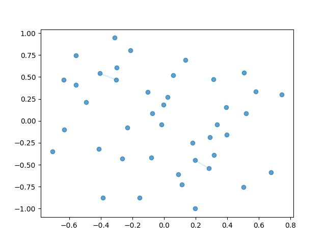

# graph_clustering
This repository presents you Filtration Clustering - graph clustering algorithm based on filtration process. The proposed method constructs a Vietoris-Rips filtration to generate a sequence of simplicial complexes. Basically, it is a generalization of graphs, where vertices can be groupped in larger sets:
- Vertices - $\{v_i\}$ 0-dim simplexes
- Edges - $\{v_i, v_j\}$ 1-dim simplexes
- Triangles - $\{v_i, v_j, v_q\}$ 2-dim simplexes

Core idea of Vietoris-Rips filtration is to dynamically increase distance threshold $\epsilon$ and add edges between close enough points, such that $d(a,b) \leq \epsilon$. Here is visualization [^1]:

Filtration Clustering applies a modified clique percolation technique [^2] to detect clusters as dense regions of triangles (2-simplices). By analyzing the evolution of clusters across filtration thresholds, the algorithm directly optimizes clustering quality metric. This approach uniquely treats the filtration process as a search space for clustering optimization, a novel view on graph clustering.

# Contents
- `scripts` contain main algorithms
- `notebooks/` - experiments with metric graphs
- - `notebooks/syntetic_example.ipynb` - simple example of how clustering is done
- - `clustering_comparison.ipynb` - clustering of city graphs
- `transport_clustering_experiments/` contains VRP benchmarks
- - `transport_model_syntetic.ipynb` - experiment with generated graph of deliveries
- - `transport_model.ipynb` - experiment with real data of taxi deliveries
- `ground_truth_clustering_experiment/experiment.ipynb` - clustering of graphs with known ground truth communities

Clustering performance is compared with Louvain [^3], Leiden [^4] and KMedoids [^5] algorithms.
More details can be found in `Thesis.pdf`.

[^1]: Another interactive [visualization](https://sauln.github.io/blog/nerve-playground/)
[^2]: Palla G, Derényi I, F. I., and T, V. [Uncovering the overlapping community structure of complex networks in nature and society](https://www.nature.com/articles/nature03607). Nature (2005)

[^3]: Blondel, V. D., Guillaume, J.-L., Lambiotte, R., and Lefebvre, E. [Fast unfolding of communities in large networks. Journal of Statistical Mechanics: Theory and Experiment](https://arxiv.org/abs/0803.0476) 2008, 10 (oct 2008), P10008.
[^4]: Traag V.A., Waltman L., v. E. N. [From louvain to leiden: guaranteeing well-connected communities](https://www.nature.com/articles/s41598-019-41695-z). Nature (2019).
[^5]:Park, H.-S., and Jun, C.-H. [A simple and fast algorithm for k-medoids clustering](https://doi.org/10.1016/j.eswa.2008.01.039). Expert Systems with Applications.